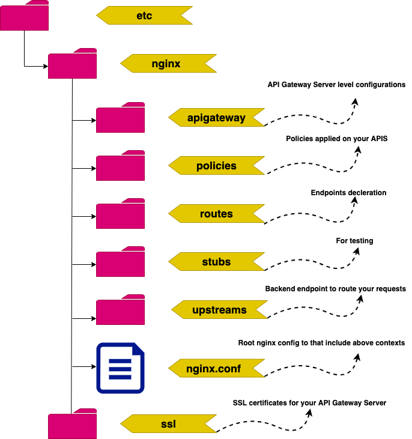
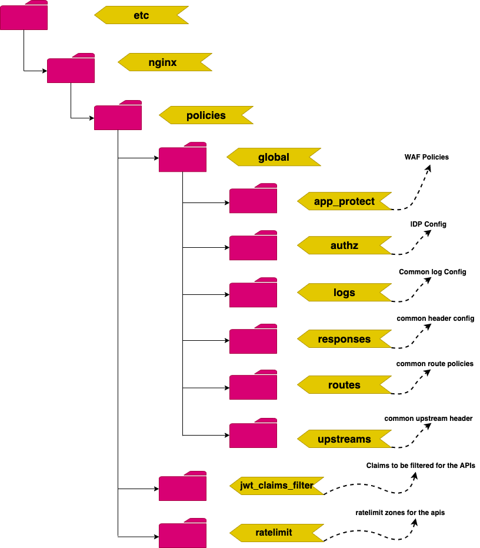

# diy-nginx-plus-api-gateway-security-policies - build a opinionated APIGateway with security policies

## Pre-requisites

### Obtain the NGINX Plus license :
```
   1. If you are planning to run nginx plus as apigateway then copy nginx plus license nginx-repo.crt & nginx-repo.key to /etc/ssl/nginx/
   2. If you are planning to run nginx oss as apigateway then you don't need nginx plus license, however you will have to inspect the conf files inside to remove 
   certain directive which pertains to nginx plus. I have highlighted those directives with comments in the conf files.
```
## To build image for GCP using packer.
```
   1. Enter your Google Project ID here https://github.com/b-rajesh/diy-nplus-api-gwy-security-policies/blob/master/nginx_plus_gcp_ubuntu.json
   2. Enter image name(purpose) appropriately here in this file https://github.com/b-rajesh/diy-nplus-api-gwy-security-policies/blob/master/nginx_plus_gcp_ubuntu.json
   3. Run this command in the command line prompt -->  packer build nginx_plus_gcp_ubuntu.json
   4. Verify the image in the GCP console under images and note down the image name to refer it here https://github.com/b-rajesh/gcp-nginx-plus-with-nlb/blob/master/terraform.tfvars --> nginx_plus_image_name_on_gcp
```
## Run NGINX Plus docker container

### Build an image from your Dockerfile :

```bash
# To build the Docker image : Run command from the folder containing the `Dockerfile`
$ docker build -t nginx-plus-api-gateway-nap .
# If you made changes to the Dockerfile and need to rebuild you probably need to use--no-cache
$ docker build -t nginx-plus-api-gateway-nap . --no-cache
```

### Start the Nginx Plus container :

```bash
# Start a new container and publish container ports 80 (HTTP), 443 (HTTPS), 8000 (Demo instructions) and 8080 (NGINX Plus Dashboard) to the host
$ docker run --name mynginxplus_simple  -p 80:80 -p 443:443 -p 8080:8080 -p 8000:8000 -p 9000:9000 -d nginx-plus-api-gateway-nap
```

### Access NGiNX Plus Dashbaord :

```bash
# Open your favourite dashboard and enter the below url
$ http://localhost:8080/dashboard.html
```

### Start testing the deployed API :

```bash
# [If you're using httpie] Main API traffic flowing through port 80. 
$ http :/warehouse-api/inventory
$ http :/warehouse-api/pricing
# [If you're using curl] Main API traffic flowing through port 80.
$ curl http://localhost/warehouse-api/inventory
$ curl http://localhost/warehouse-api/pricing

```

### Start testing the default API comes with NGiNX Plus API Gateway :

```bash
# [If you're using httpie] Main API traffic flowing through port 80. 
$ http :8080/api/6/nginx
$ http :8080/api/6/http/upstreams
# [If you're using curl] Main API traffic flowing through port 80.
$ curl http://localhost:8080/api/6/nginx
$ curl http://localhost:8080/api/6/http/upstreams

```


### Docker commands to clean the nginx-plus containers and images create abvoe :

```bash
# To list nginxplus running container
$ docker ps | grep mynginxplus_simple

# To stop the nginxplus running container
$ docker stop | docker ps | grep mynginxplus_simple

# To remoe  the nginxplus iamge
$ docker rmi nginx-plus-api-gateway-simple
```

### What's in the folder structure


### Policies folder structure

